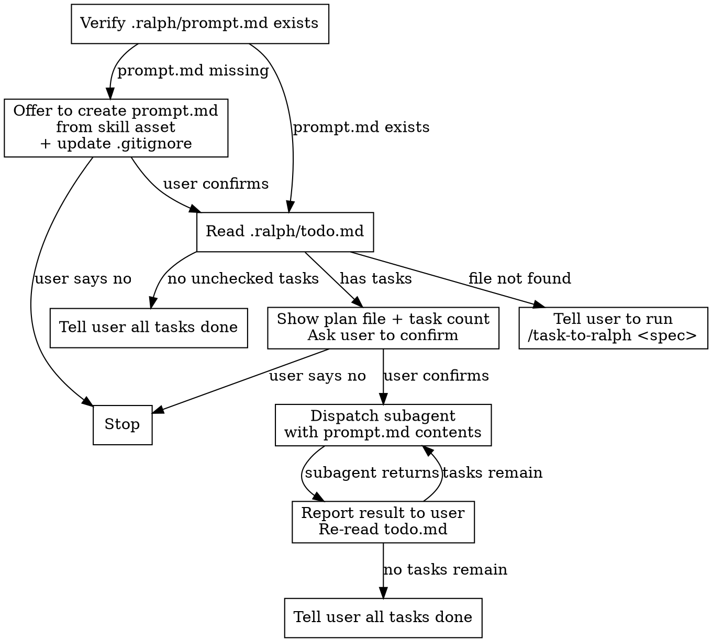

# Ralph Work

Execute tasks from `.ralph/todo.md` one at a time using subagents for clean isolation between tasks.

## Process

### Step 1: Verify prompt file

Check whether `.ralph/prompt.md` exists. If it doesn't:

1. Offer to create it from this skill's bundled template at `assets/prompt.md` (copy the file into `.ralph/prompt.md`).
2. Also offer to add `.ralph/` to the project's `.gitignore` (append the line if not already present; create `.gitignore` if missing).

Ask the user to confirm each offer before acting. If the user declines creating `prompt.md`, stop — the skill cannot proceed without it.

### Step 2: Check for todo file

Read `.ralph/todo.md`. If it doesn't exist:

> No `.ralph/todo.md` found. Use `/task-to-ralph <spec-file>` to generate tasks from a spec.

Stop here.

### Step 3: Parse and present

Extract from the todo file:

- The **plan file** from the `**Plan:**` line
- Count of **unchecked tasks** (`- [ ]` at the top indent level only — ignore subtasks)
- Count of **completed tasks** (`- [x]`)

If there are zero unchecked tasks, tell the user all tasks are complete and stop.

Otherwise, present a summary and ask for confirmation:

> **Plan:** `<spec-file-path>`
> **Tasks remaining:** N (M completed)
>
> Ready to start working through these tasks? (y/n)

### Step 4: Dispatch subagent

When the user confirms, read `.ralph/prompt.md` and dispatch a **general-purpose subagent** with the full contents of `prompt.md` as the prompt. This gives each task a completely fresh context — no bleed-through from prior tasks.

### Step 5: Loop or finish

When the subagent returns:

1. Report the result to the user (brief summary of what was done)
2. Re-read `.ralph/todo.md` to get the current task count
3. If unchecked tasks remain, tell the user the updated count and dispatch the next subagent (no need to re-confirm)
4. If no unchecked tasks remain, tell the user all tasks are done and stop
